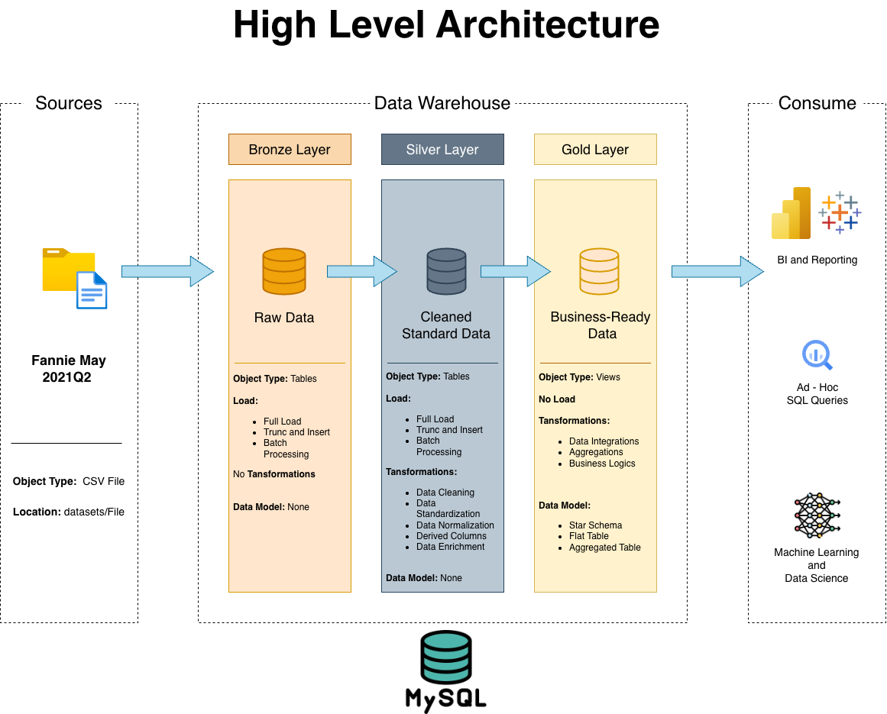
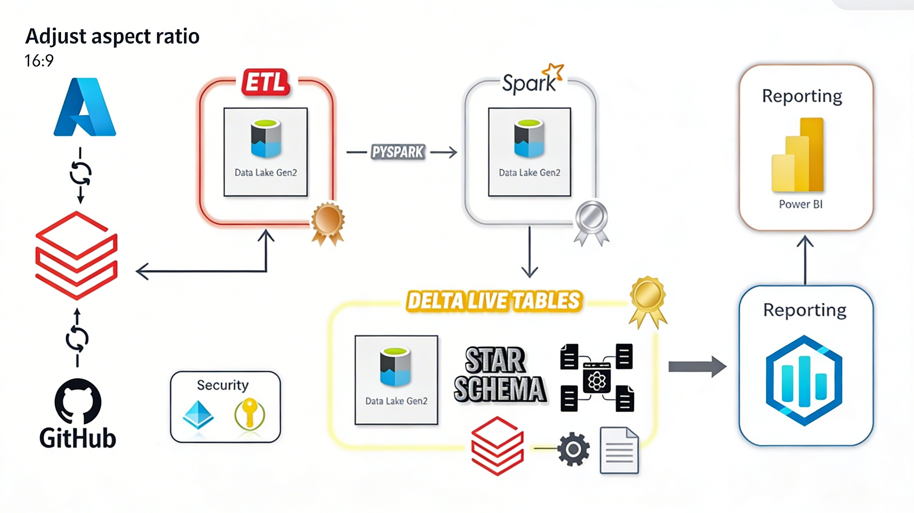
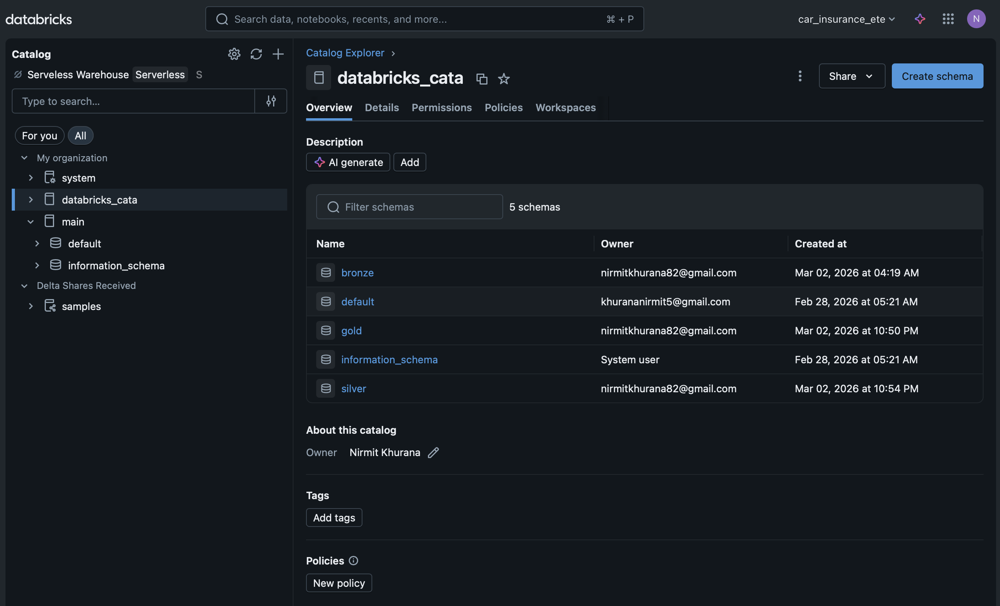
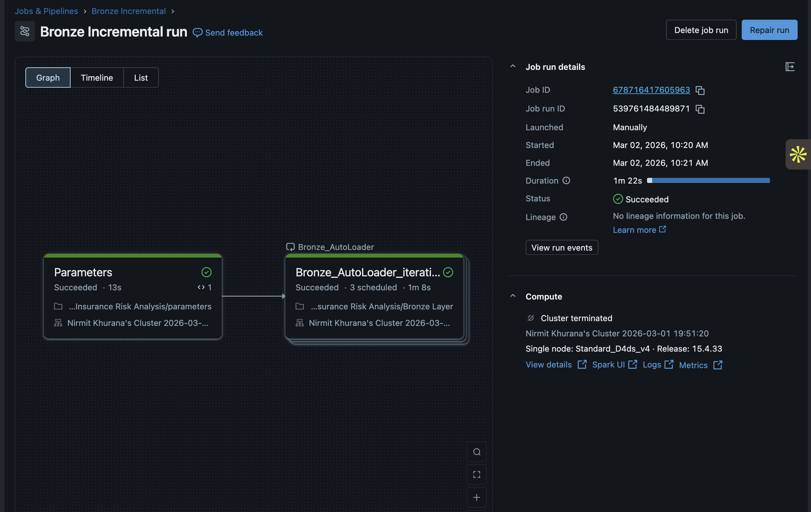

<a name="readme-top"></a>

<div align="center">
  <h1 align="center">Azure Databricks Retail Data Engineering Pipeline</h1>

  <p align="center">
    A production-grade Medallion Architecture (Bronze, Silver, Gold) handling incremental data loading, Slowly Changing Dimensions (SCD Type 1 & 2), and Delta Live Tables (DLT).
    <br />
  </p>
</div>

<details>
  <summary>Table of Contents</summary>
  <ol>
    <li><a href="#about-the-project">About The Project</a></li>
    <li><a href="#architecture--data-flow">Architecture & Data Flow</a></li>
    <li><a href="#technical-implementation">Technical Implementation</a></li>
    <li><a href="#getting-started">Getting Started</a></li>
    <li><a href="#repository-structure">Repository Structure</a></li>
    <li><a href="#future-enhancements">Future Enhancements</a></li>
  </ol>
</details>

## About The Project

This repository contains an end-to-end data engineering solution built natively in Azure Databricks. Processing a retail dataset (Orders, Customers, Products, and Regions), the pipeline ingests raw Parquet files from Azure Data Lake Storage (ADLS) Gen2 and transforms them into a fully optimized Star Schema ready for BI consumption. 

The project goes beyond basic ETL scripts by implementing enterprise-grade features: idempotent streaming, Unity Catalog governance, Object-Oriented Programming (OOP) in PySpark, and declarative pipelines using Delta Live Tables (DLT).

### Built With

* **Azure Databricks** (Compute, Workflows, Serverless SQL Warehouses)
* **Azure Data Lake Storage Gen2** (Hierarchical Storage)
* **PySpark & Spark Structured Streaming**
* **Unity Catalog** (Data Governance & Function Management)

<p align="right">(<a href="#readme-top">back to top</a>)</p>

## Architecture & Data Flow

### High Level Architecture

<p align="center">
  
</p>

<p align="center"><em>Medallion Architecture overview — Sources (Raw Parquet) → Bronze (Raw Ingestion) → Silver (Cleansed & Enriched) → Gold (Star Schema) → BI & Reporting.</em></p>

---

### End-to-End Data Flow

<p align="center">
  
</p>

<p align="center"><em>Complete data flow from Azure ADLS Gen2 through PySpark ETL, Spark processing, and Delta Live Tables into Power BI reporting — with GitHub version control and Unity Catalog security governance.</em></p>

---

### Unity Catalog Governance

<p align="center">
  
</p>

<p align="center"><em>Unity Catalog Explorer showing the <code>databricks_cata</code> catalog with isolated Bronze, Silver, and Gold schemas — ensuring data governance across all pipeline layers.</em></p>

---

The pipeline strictly adheres to the **Medallion Architecture** design pattern, fully managed via Unity Catalog:

1. **Source / ADLS Gen2:** Raw retail data (Parquet format) is uploaded incrementally into an ADLS Gen2 container.
2. **Bronze Layer (Raw Ingestion):** Databricks Auto Loader ingests new files idempotently, handling schema evolution and saving data in its rawest state.
3. **Silver Layer (Cleansed & Enriched):** Data is cleaned, data types are cast, missing values are handled, and complex transformations are executed.
4. **Gold Layer (Star Schema):** Data is modeled into Fact and Dimension tables featuring Slowly Changing Dimensions (SCD).
5. **Serving:** Databricks Serverless SQL Warehouse connects the optimized Gold tables to Power BI.

<p align="right">(<a href="#readme-top">back to top</a>)</p>

## Technical Implementation

### 🥉 Bronze Layer
* **Dynamic Auto Loader:** Utilizes Spark Structured Streaming (`cloudFiles`) to incrementally read Parquet files.
* **Idempotency & Checkpointing:** Uses RocksDB state stores to guarantee exactly-once processing. 
* **Workflow Orchestration:** Managed via a parameterized Databricks workflow DAG that iterates over source folders dynamically.

<p align="center">
  
</p>

<p align="center"><em>Databricks Workflow DAG — the Bronze Incremental run executing the <code>Parameters</code> task followed by the <code>Bronze_AutoLoader</code> iteration, completing in 1m 22s with a Succeeded status.</em></p>

### 🥈 Silver Layer
* **Data Cleansing & Enrichment:** Drops `_rescued_data` columns, standardizes timestamps, and applies custom logic.
* **Modular Codebase:** Separate processing notebooks for `Customers`, `Orders`, `Products`, and `Regions` to ensure code maintainability.

### 🥇 Gold Layer
* **SCD Type 1 (`Dim_Customers`):** PySpark Upsert (`MERGE INTO`) logic successfully handles slowly changing customer profiles, automating surrogate key generation and timestamp updates based on the `init_load_flag`.
* **SCD Type 2 (`Dim_Products`):** Delta Live Tables (DLT) declarative pipelines automate history tracking (managing `__START_AT` and `__END_AT` dimensions) while enforcing data quality via DLT Expectations.
* **Fact Table (`Fact_Orders`):** Aggregates business metrics by joining dimension surrogate keys, dropping natural raw keys to optimize warehouse storage.

<p align="right">(<a href="#readme-top">back to top</a>)</p>

## Getting Started

### Prerequisites
* An active Azure Subscription.
* Azure Databricks Workspace (Premium tier recommended for full Unity Catalog features).
* An ADLS Gen2 Account with Hierarchical Namespaces enabled.

### Setup Instructions
1. **Infrastructure Configuration:**
   * Create an **Access Connector for Azure Databricks**.
   * Assign the `Storage Blob Data Contributor` IAM role to the connector for your ADLS account.
2. **Unity Catalog Initialization:**
   * Configure the Unity Catalog Metastore and map it to your ADLS `metastore` container.
   * Create External Locations for the `source`, `bronze`, `silver`, and `gold` storage containers.
3. **Workspace Import:**
   * Clone this repository and import the notebooks into your Databricks workspace.

<p align="right">(<a href="#readme-top">back to top</a>)</p>

## Repository Structure

```text
├── docs/
│   ├── HighLevelArchitecture.png        # Medallion Architecture diagram
│   ├── data_flow.jpeg                   # End-to-end Azure data flow
│   ├── bronze_incremental_job_run.png   # Databricks Workflow DAG screenshot
│   └── databricks_catalog_explorer.png  # Unity Catalog Explorer screenshot
├── dataset/
│   ├── customers/                       # Customer dimension data (Parquet)
│   ├── orders/                          # Order transaction data (Parquet)
│   ├── products/                        # Product dimension data (Parquet)
│   └── regions/                         # Region dimension data (Parquet)
└── readme.md
```

The Databricks Workspace notebooks (imported separately) follow this modular structure:

```text
src/
├── bronze/
│   ├── parameters.py                    # Dynamic source folder config
│   └── Bronze Layer.py                  # Auto Loader streaming ingestion
├── silver/
│   ├── Silver Layer Customers.py        # Customer data cleansing
│   ├── Silver Layer Orders.py           # Order data cleansing
│   ├── Silver Layer Products.py         # Product data cleansing
│   └── Silver Regions.py               # Region data cleansing
└── gold/
    ├── Gold Customers.py                # SCD Type 1 — Dim_Customers
    ├── Gold Products DLT.py             # SCD Type 2 — Dim_Products (DLT)
    └── Fact Orders.py                   # Fact_Orders aggregation
```

<p align="right">(<a href="#readme-top">back to top</a>)</p>

## Future Enhancements

- [ ] Add Power BI dashboard screenshots to the Gold layer showcase
- [ ] Implement data quality monitoring with DLT Expectations dashboard
- [ ] Add CI/CD pipeline for automated notebook deployments via GitHub Actions
- [ ] Integrate Azure Key Vault for secrets management

<p align="right">(<a href="#readme-top">back to top</a>)</p>
